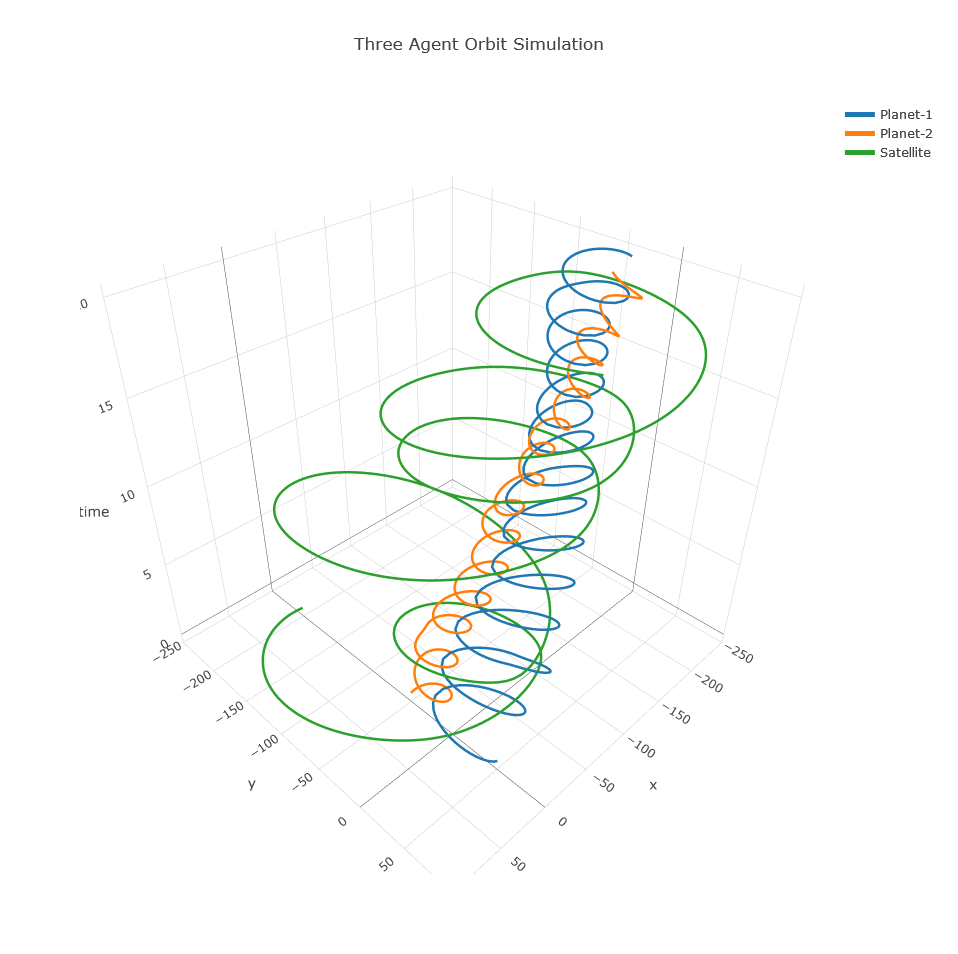
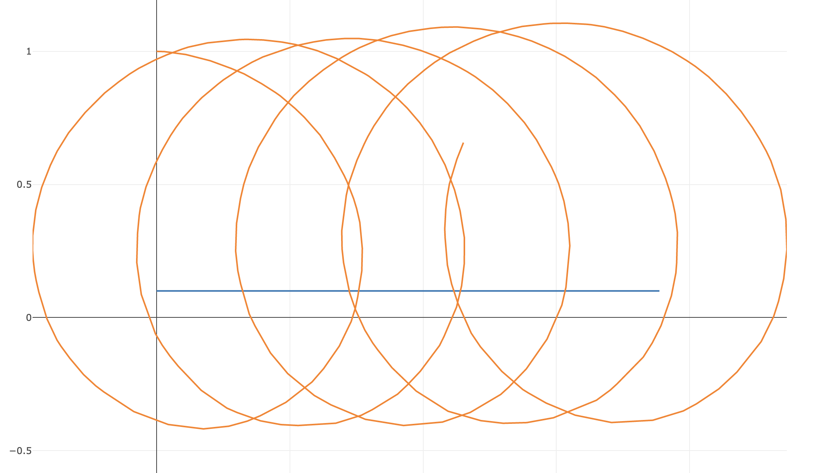

# Sedaro Nano

The tiniest possible mockup of our system

## Gus's Notes

My efforts to extend the basic version of Sedaro's system were mostly successful! Here is a general summary of what I accomplished:
- Added tests to `App.test.js` to understand the processing of the simulation data
- Added a third dimension to the plot to more clearly show the progression of the system through time
- Updated simulation code with a vector-based system that sums the gravitational forces, calculates the resulting acceleration on each agent, and updates the resulting velocity and position changes across each time step
- Added a third body to the simulation to increase complexity and sensitivity to initial conditions
- Added a loop in the simulation code to test variations in the initial conditions and save additional simulation results
- Attempted to add a dropdown menu to select the simulation results to visualize

The reason I chose to make these changes was so that I could use this technology to visualize a three-body problem and the sensitivity of the system to its initial conditions. The goal I gave myself was to implement mechanics such that summing the gravitational forces of each of these three agents on each other would be possible, and also implement some way to show how subtle changes in the initial conditions would have major effects on the evolution of the system. I consider this a partial success because I was able to enhance the simulation to handle gravity, but didn't have enough time to work out the solution to my dropdown menu idea to gracefully change the data visualized without changing the variables manually.

If I had more time to work on this project, I would do a more thorough investigation into why adding the Plotly.js element hides the rest of the HTML elements in the JSX code returned at the bottom of `App.js`. At first I thought I would get around this by extending the way the simulation data is saved, but realized visualizing all the data at once would be too messy, and I'd still probably need some way to change the data viewed at any one time.

If I solved the problem of toggling simulation data and still had enough time, I would have liked to add an animation slider so I could calculate the physics in three physical dimensions and still show the evolution over time. The simulation aspect would have been easy since I already vectorized the system, it would just be a matter of figuring out how to visualize the animation!



### Setup

Setup is the same as below!

1. Clone this repository.
2. To compile and run the app, execute the following command
   - ```docker compose up app```

### To-Do
- Fix multi-sim visualization for sensitivity of third body ICs
- Add animation slider
- Investigate timeStep increment mechanism

### Change Log

third-body
- Try to add a drop down menu to choose the simulation to plot
- Add multiple simulation runs to show sensitivity
- Add numpy requirement to Dockerfile
- Add third body
- Fix bug with velocity update not accounting for time step

add-sim-body
- Add more realistic orbital mechanics in `sim.py`
- Clean `sim.py`

add-t-dim
- Plot time as third dimension
- Add trace info for plotting with `addTraceInfo`
- Add test for `processData` with mock simulation data
- Move data processing to `processData` in `dataUtils.js`
- Increase heap size to prevent browser shut down

## Original Instructions

The goal of this mini-project is to gain a better understanding of your ability to **be creative**, **think through problems**, and **solve relevant challenges** related to the engineering roles at Sedaro. This is an opportunity for you to show off your personal strengths. Don't focus on the simple contributions and instead aim to really impress us. To best set expectations, we won't be impressed by an ability to write boilerplate or copy and paste tutorials.  A submission that makes us say "Wow, that's SMART!" is far better than one that makes us say "This is really robust.". Get creative, the prompt is intentionally very open-ended.

Within the next `7` days, attempt the following mini-project and return your solution containing the full project (less anything that would be .gitignored such as `node_modules`) and any notes on how to setup and run your specific solution. As important as your solution, we are interested in understanding your thought process and your ability to clearly communicate your approach so a writeup should also be included. For the writeup, include some details on your solution, any novel or creative aspects of the solution, and what additional features or improvements you would add if you were given more time.

Please note that if you end up getting to a solution that you aren't happy with or that is a dead end, document why and we will call that good enough. Please don't invest too much time. A writeup of why a solution is insufficient and how you might approach it differently often tells us what we need to know.

If you have any questions or issues while you work through this problem or if you get stuck, please contact Bas Welsh at sebastian.welsh@sedarotech.com.

Once you have completed your solution, please email to kacie.neurohr@sedarotech.com and sebastian.welsh@sedarotech.com

### Setup

1. Clone this repository.
   - Please note that **only** cloning via HTTPS is supported
   - Please **do not** commit changes to any branch of this repository. If you would like to use git, you may fork this repository to create a private repo of your own
2. To compile and run the app, execute the following command
   - ```docker compose up app```
4. That's it ✅! Sedaro Nano should now be available via web browser at http://localhost:3000/. It may take a few moments for the container to fully come up and serve the page. Changes to the react app should auto reload the webpage.

### Your Task

**Review the few files that make up Sedaro Nano, figure out how it works, and then add to it in whatever way <u>best</u> shows off your unique skills + creativity!**

### Some Project Ideas

- Simulator:
  - Improve the Q-Range KV Store data structure
  - Make the system more generic/extensible
  - Make it fast
- Front End:
  - Add cool visualizations and interactivity
  - Improve efficiency/caching
- Data:
  - Utilize a better persistence layer than a js file
  - Do some statistical analysis on the data
  - Set up background jobs to preprocess data
- Modeling & Simulation:
  - Improve the numerical stability of the simulation functions
  - Implement additional modeling and simulation scope
  - Analyze the sensitivity to initial conditions
- Etc:
  - Port to a language of your choice
  - Set up testing
- Whatever you want; these are just suggestions to get you thinking


